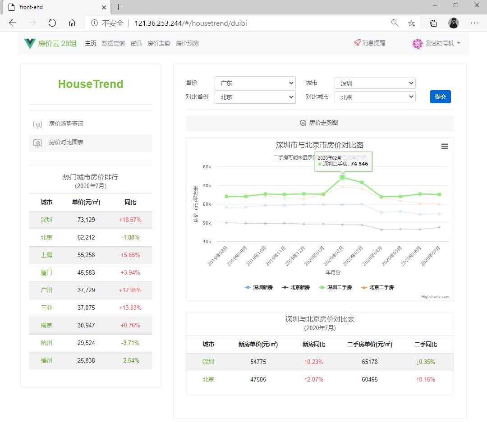
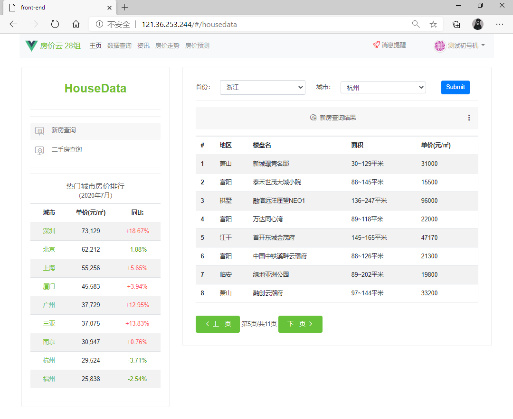

# 城市房价数据分析系统
房价的变化扣动着亿万人民的心弦，而掌握房价的走向与趋势，也成为了诸多用户的需求与需要。

城市房价数据分析系统采用前后端分离的架构，前端使用 Vue，后端使用 Python/Flask，MySQL 提供数据存储。

主要包括**数据爬取、数据存储、数据可视化、后台管理、房价预测**五大部分组成。其中，数据可视化包含三个业务：房价查询、房价对比、房价趋势；后台管理包含五个业务：用户登录与注册、权限管理、咨询管理、用户评论、用户通知。

> 网址：http://121.36.253.244






## 文件目录
```bash
|--back-end 后端代码
|--front-end 前端代码
|--houseprice_crawler 房价数据爬虫
|--news_crawler 房价新闻爬虫
|--predict_crawler 房价预测爬虫
|--prediction 房价预测
```


## 本地运行

### 后端
进入后端文件夹
```
cd back-end
```

安装 `requirements.txt` 依赖
```
pip install -r requirements.txt
```

运行 flask
```
flask run
```

### 前端
进入前端文件夹
```
cd front-end
```

下载开发依赖包
```
npm install
```

启动前端项目运行
```
npm run dev
```


## 小组成员
张雷 （组长）

汪志豪

王亮

夏宇航
